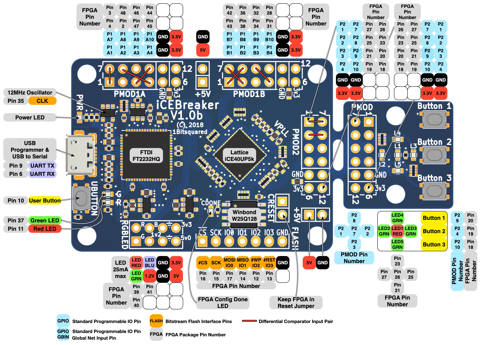

# hdl-projects

## Learn the Basics

### Verilog / SystemVerilog

- [x] [icebreaker-workshop](https://github.com/icebreaker-fpga/icebreaker-workshop)
- [ ] read book "RTL Modeling with SystemVerilog for Simulation and Synthesis" by Stuart Sutherland
- [ ] read book "Constraining Designs for Synthesis and Timing Analysis" by Sridhar Gangadharan and Sanjay Churiwala
- [ ] set up open source toolchain for synthesis and verification
- [ ] implement driver for serial 7-segment display
  - driver IC is [TM1637](https://www.makerguides.com/wp-content/uploads/2019/08/TM1637-Datasheet.pdf)
- [ ] start a computer graphics project
- [ ] implement 12 bit computer
  - [ ] read book "Prozessorentwurf mit Verilog HDL" by Dieter Wecker

### VHDL

- [ ] ...

### Python to HDL

- [ ] check out [Amaranth](https://github.com/amaranth-lang/amaranth) hardware description language

## Further Projects

- [ ] have an ASIC manufactured 

## Hardware

- [iCEBreaker](https://github.com/icebreaker-fpga/icebreaker)  development board V1.0e
  - [LATTICE iCE40](https://www.latticesemi.com/-/media/LatticeSemi/Documents/DataSheets/iCE/iCE40-UltraPlus-Family-Data-Sheet.ashx) UltraPlus 5K FPGA

